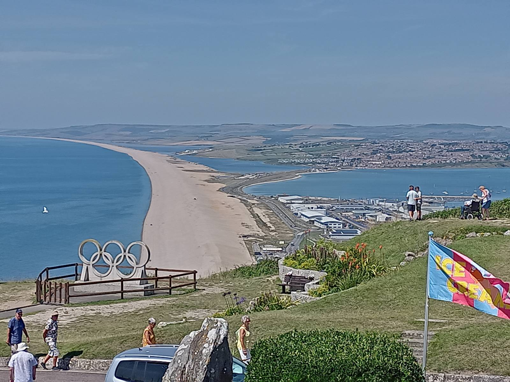
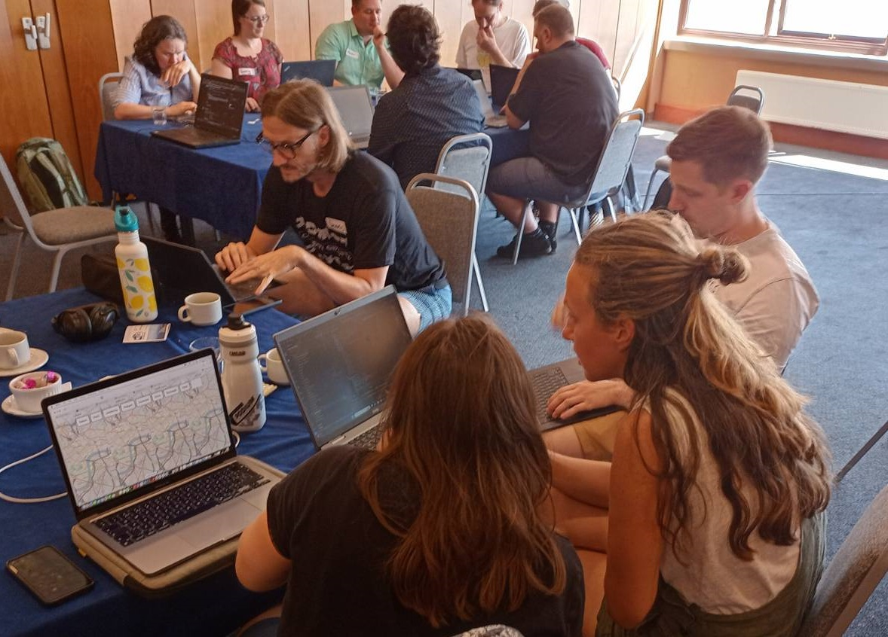
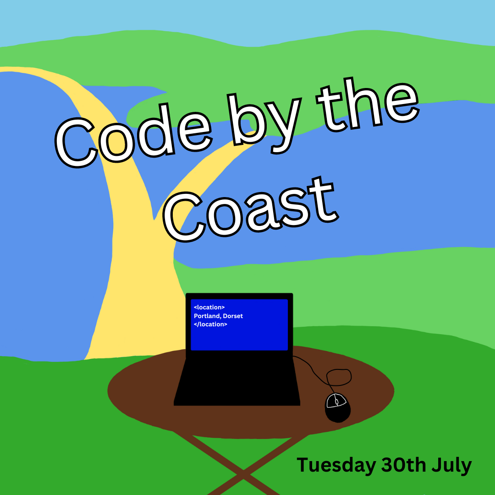

## OSGeo:UK 2024 Code Sprint - Code by the Coast

 

On Tue 30th July 2024, we had a great day at Code by the Coast, at The Heights, Portland, Dorset. OSGeo:UK's latest code sprint brought 18 people together to work on a number of FOSS4G projects, including Terra Draw and GIFramework Maps.

> "The code sprint let us introduce GIFramework Maps to new developers and will help us to start growing the community for the project. We looked at some important topics including getting the application to translate into other languages like Welsh.

> "On behalf of the development team, we’d like to thank everyone that took time to work with us and look forward to working with you and others in the future."

> *GIFramework Maps Team*

> "The codesprint was a great opportunity to get people familiarised with Terra Draw and improve the onboarding experience onto the project. We had five pull requests in total, focusing on documentation and testing of the application. We also found a bug with the OpenLayers adapter which wouldn't have been uncovered and diagnosed without the help of the participants (it was a Windows only issue!)."

> *James Milner, Terra Draw*

We also progressed the registration of Terra Draw, GIFramework Maps and XYZ as OSGeo Community projects, and spent a bit of time looking at OGC API Standards including EDR (Environmental Data Retrieval) and the Marine Tools QGIS Plugin.

Along with the great coding and networking, we also had some lovey views in an excellent venue. It was rather warm though, but The Heights rose to the challenge and provided us with iced coffee!

Many thanks to both OSGeo:UK GoFundGeo and Addresscloud for sponsoring the event, and for those participants who paid for their own tickets - we couldn't have done it without you! 

 

----

We will be running our first UK code sprint, Code by the Coast, on Tuesday 30th July 2024, at the The Heights Hotel, Portland, Dorset, UK. [~~Book your tickets now~~](https://www.eventbrite.co.uk/e/osgeouk-2024-code-sprint-tickets-870353269057). SOLD OUT. Please email us on  if you have any questions. 

**All attendees should have recieved a welcome email with information on the day. If you haven't, please email us ASAP.**

This is a great opportunity to work on some up and coming open-source projects and to meet up with other open-source developers here in the UK. Whether you are new to open-source geospatial development or have been working in the industry for years we hope this event will be the summer work-cation you need!

**Bring your device and join us at the Portland Heights Hotel where you can choose to work on any number of the open-source applications on offer.**

### Projects

- **Terra Draw**
    - A library for drawing on maps that supports Mapbox, MapLibre, Google Maps, OpenLayers and Leaflet out the box
    - [GitHub repo - JamesLMilner/terra-draw](https://github.com/JamesLMilner/terra-draw)
	- [Issue for OSGeo:UK Code Sprint](https://github.com/JamesLMilner/terra-draw/issues/283)

- **GIFramework Maps**
    -  A .NET based web map built with OpenLayers and Bootstrap
    - [GitHub - Dorset-Council-UK/GIFramework-Maps](https://github.com/Dorset-Council-UK/GIFramework-Maps)

- **How to register your Open Source Geospatial project as an OSGeo Community Project**
	- Registering your project as an OSGeo Community project is a great way of saying that your project is open source, and open to contributors. Nick Bearman will outline the process, and be on hand to help different projects register. The key elements to be an OSGeo Community Project are:
		- Be geospatial
		- Have a free license or an open source license.
		- Welcome participation and new contributors.
	- More info at [OSGeo Incubation Committee](https://www.osgeo.org/about/committees/incubation/) and [OSGeo Community Projects](https://wiki.osgeo.org/wiki/OSGeo_Community_Projects).
	
- **OGC API standards, in particular Environmental Data Retrieval, and CoverageJSON**
    - A QGIS Plugin to support access to servers using the OGC API - Environmental Data Retrieval (EDR) standard, with one of the outputs formats being CoverageJSON - not currently supported directly in QGIS. Useful to add?
    - [OGC API - EDR](https://ogcapi.ogc.org/edr/)
	- [QGIS Plugin](https://github.com/MetOffice/qgis-plugin-edr)
	- [CoverageJSON](https://github.com/opengeospatial/CoverageJSON)
	
- **Marine Tools QGIS Plugin**
	- [Marine Tools](https://plugins.qgis.org/plugins/marinetools/)
	- Tim Le Bas

It is possible that more projects will join us on the day and we are sure there will be some exciting development goals to help out with on the day. If you would like your project to join us, please let us know . 

### Schedule

The day will run from 9:30am to 5pm. We have catering arranged as follows:

- From ~9:00am - 9:45am: Arrivals with tea / coffee and Danish pastries 
- Mid morning drinks: 11:00am - 11:30am
- Lunch: 12:30pm – 1:30pm
- Afternoon drinks: 3:00pm - 3:15pm
- Finishing at approx: 5:00pm

### Location - The Heights Hotel

[The Heights Hotel](https://www.openstreetmap.org/#map=18/50.55533/-2.44230) 
Isle of Portland 
Nr Weymouth 
Dorset 
DT5 2EN 

Catering is provided, sponsored by OSGeo:UK:

- Coffee & tea on arrival with Danish pastries
- Mid-morning coffee & tea with biscuits
- Lunch, soup and sandwiches taken in the Bistro
- Afternoon coffee & tea with cake

### Travel

Weymouth is easily accessible by train, with a half-hourly direct service from London (via Southampton) and regular services from Bristol. 

The number [1 bus runs every 15 minutes](https://www.firstbus.co.uk/wessex-dorset-south-somerset/plan-journey/timetables?service=1&day=mf) from Weymouth train station to Portland. Alight at the "Portland Heights" stop. A single ticket from the train station to The Heights costs £2 and can be [bought on the First Bus App, online, or on the bus using contactless or cash](https://www.firstbus.co.uk/wessex-dorset-south-somerset/tickets/where-buy). 

If you are coming by train, let us know when you plan to arrive and we can arrange a pick-up shuttle from the station to the hotel. 

The hotel also has free parking for anyone attending the Code Sprint. 

We encourage everyone to travel by public transport/car share or under their own steam if possible.

### Accommodation

There are a range of places to stay on Portland and in Weymouth for a range of budgets. 

[The Heights Hotel](https://heightshotel.com/) are delighted to accommodate guests attending. Please contact the hotel directly, to obtain the best rate over the phone (01305 821361) for the date(s) required. 

### Code of Conduct

Participants at the Code Sprint are expected to act respectfully toward others in accordance with the [FOSS4G:UK Online Code of Conduct](/foss4guklocal2023/code-of-conduct). *Short version: everyone is welcome, make everyone welcome, be nice.* 

### Funding availability

OSGeo:UK are funding the event (through [GoFundGeo](gofundgeo.html)) and as such we have limited additional funds. If you feel you would like to attend but can't because of funding issues, please reach out to us. We will consider funding on a case-by-case basis. 

Additionally if care commitments are limiting your ability to attend, again please reach out to us to discuss options. 

Please email us on . 

### Tickets

**The event is provided free of charge but spaces are strictly limited. Thanks to OSGeo:UK and Addresscloud we have been able to offer 20 places free of charge**

 

*Addresscloud are a big advocate and strong backers of OSGeo:UK and FOSS4G events. They help insurers understand geographic risk. Their award-winning platform provides leading insurers with APIs and applications to make better underwriting decisions.*

You can also buy a "Sponsored place" ticket where you pay for the full cost of your ticket. If you can afford to pay for your ticket this will ensure there are free places available for those that can't. Thank you for supporting this OSGeo:UK event!

**If you are a UK open-source business and wish to support the event then please get in touch and you could sponsor some more places.**

We hope you will join us this summer as we...code by the coast!

*Spot a typo or error? Fix on [GitHub](https://github.com/osgeouk/website/blob/gh-pages/code-sprint-2024.md){:target="_newpage"} ([How?](https://uk.osgeo.org/editing-on-github){:target="_newpage"})*

<!-- Jonny Huck Email Obfuscator -->
<!-- Simply add...    ...wherever you would like the email link to appear -->

