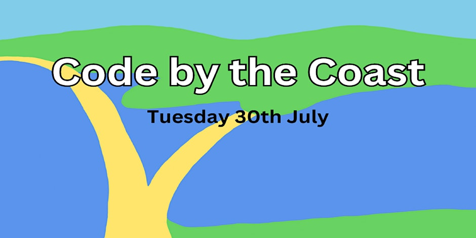

*[12/04/2024: Flexurba recieves the GISRUK & OSGeo:UK GoFundGeo Award](gofundgeo.html#flexurba-gisruk--osgeouk-gofundgeo-award)*

*[28/02/2024: QGIS 3.36 Maidenhead released - read more](qgis.html)*

### UK Code Sprint

We will be running a UK code sprint this summer on Tuesday 30th July 2024, at the The Heights Hotel, Portland, Dorset, UK. 

This is a great opportunity to work on some up and coming open-source projects and to meet up with other open-source developers here in the UK. Whether you are new to open-source geospatial development or have been working in the industry for years we hope this event will be the summer work-cation you need!

Check out the [page](code-sprint-2024.html) for more details, and if you have any questions, please email us . 

----

### OSGeo:UK Newsletter

In 2024 we plan to start sending a newsletter to the open source geo community in the UK and Ireland on a 2-3 monthly cycle. There will be general news from OSGeo and information about events including the next FOSS4GUK which we hope will be an "in person" event (see [this link](foss4guk2024/index.html) or above for details). The newsletter will not replace the UK mailing list which will continue to be the place for discussions.
You can sign up to the newsletter using the dedicated [Sign Up Link](https://stats.sender.net/forms/b4160d/view) 

 
----

### GoFundGeo & AGM 2023

OSGeo:UK AGM took place on Mon 20th Nov 2023 and the [minutes](https://uk.osgeo.org/agm/agm2023minutes.html) are now available. 

We agreed to fund a total of £5,633 across 7 projects through [GoFundGeo](gofundgeo.html):

* [pgRouting Gold Sponsorship](https://pgrouting.org/donate.html#sponsors), $1200/£963 per year
* [QGIS Sustaining Membership small level](https://www.qgis.org/en/site/about/sustaining_members.html), €1,000/£870 per year
* [James Milner, development of Terra Draw](https://github.com/JamesLMilner/terra-draw), up to £1,000
* North Road/Nyall Dawson: QGIS layout background formatting, £1,000
* [GISRUK GoFundGeo](https://2024.gisruk.org//osgeo/): £200
* Dorset Code Sprint: £600
* [qgis2web](https://github.com/tomchadwin/qgis2web): Supporting Andrea Ordonselli to take on and develop gis2web, £1,000
* As a result of sponsoring [OSGeo Projects](https://www.osgeo.org/about/how-to-become-a-sponsor/) with a total of £1,833 / $2,317, we are now an [OSGeo Silver Sponsor](https://www.osgeo.org/sponsors/). 

With thanks to the [RGS-IBG GIScience Research Group](https://geoinfo.science/){:target="_newpage"} who have provided funding of £250 to support the above projects. 

We have around £500-£1000 remaining for allocation at a later date, so if you do have a project that might qualify, please check our [funding guidelines](fundingguidelines.html) rules and let us know, via  or the [email list](https://lists.osgeo.org/mailman/listinfo/uk). 

At the AGM we also agreed to the development of a regular newsletter, and discussion of how we use our existing communications channels. 

----

### FOSS4G:UK Local 2023

[FOSS4G:UK Local 2023](foss4guklocal2023/index.html) went really well. It was held on Thurs 7th Sept, and we reached about 250 people across eight venues in two countries. We raised about £5000 for OSGeo:UK which will go towards our funding of Open Source Geospatial software over the coming year. The full programme is available in [PDF](foss4guklocal2023/2023_MAIN_Agenda - Google Sheets.pdf){:target="_newpage"} or [Google Sheets](https://docs.google.com/spreadsheets/d/1ewkqvMZqXIwDtyEtCxdKte7czpZxUjqqlCZkY1REmzc/edit?usp=sharing){:target="_newpage"}. See individual [venue pages](foss4guklocal2023/index.html#venues) pages for more details. 

We have done a short [write up](foss4guklocal2023/lessons-learned.html), summarising some of the feedback and highlighting a few of the lessons learned for next time. We’re planning to run a conference in 2024, and will be asking for volunteers early next year - so please sign up to the [mailing list](https://lists.osgeo.org/mailman/listinfo/uk) or email  to find out when we’ll be meeting to discuss this.

----

### Events

Thinking of an Open Source GIS event, and after some support? Contact us on the mailing list below and tell us your idea! See our [past events](pastevents.html){:target="_newpage"} page for details of events we have supported or organised in the past.

[FOSS4G:UK Local 2023](foss4guklocal2023/index.html) | [FOSS4G:UK Local 2022](/foss4guk2022local/) | [FOSS4GUK Online 2020](/foss4gukonline2020/) | [FOSS4GUK 2019](/foss4guk2019/)

See also our [guidelines page](foss4gukguidelines.html){:target="_newpage"} for information on setting up a FOSS4GUK event.

### Contact

For updates follow [@osgeouk on Mastodon](https://fosstodon.org/@osgeouk), [@osgeouk on Twitter](https://twitter.com/osgeouk){:target="_newpage"}, [our mailing list](https://lists.osgeo.org/mailman/listinfo/uk){:target="_newpage"}, or [our Matrix Chat Room](https://matrix.to/#/%23OSGeoUK:matrix.org){:target="_newpage"}.

### Training

See the [training page](training.html) for details of upcoming training courses related to OSGeo projects. 

Training providers- see the instructions at the bottom of that page for how to add your own courses to the list.

### Legal

OSGeo:UK is an unincorporated organisation. Our constitution, adopted in March 2016 and altered by SGM in December 2018, can be found [here](/files/OSGeoUKFinalConstitution_2018_amendments-signed.pdf){:target="_newpage"}.

Our previous constitution can be found [here](/files/OSGeo UK Final Constitution - Signed.pdf){:target="_newpage"}.

__Officers__

* Chair: [Nick Bearman](https://twitter.com/NickBearmanUK)
* Secretary: [Antony Scott](https://twitter.com/antscott)
* Treasurer: [Matt Travis](https://twitter.com/Yakus)

__Committee__

* [Dave Barter](https://twitter.com/NautoGuide)
* [Tom Chadwin](https://en.osm.town/@tomchadwin)
* [Alastair Graham](https://social.vivaldi.net/@ajggeoger)
* [Tom Armitage](https://twitter.com/MapNav_Tom)
* [Joseph Seddon](https://twitter.com/josephseddon) *co-opted non-voting member*

### Funding

From time to time we may choose to financially support an open source GIS project, or help someone attend an event. See [funding guidelines](fundingguidelines.html){:target="_newpage"} for more details on how to apply.

[GoFundGeo](gofundgeo.html){:target="_newpage"} annually funds a range of Open Source Geospatial software projects that will have an impact in the UK. Each year we use the surplus from our FOSS4G:UK conferences to fund relevant projects in the range of £500 - £1000 each. We also occasionally make ad-hoc donations to revelant projects, see [past donations](pastdonations.html){:target="_newpage"} for yearly breakdowns on the projects we have supported to date.

### Donate

Help us support and promote the use of open source geospatial software within the UK [by donating via PayPal](donations.html){:target="_newpage"}.

